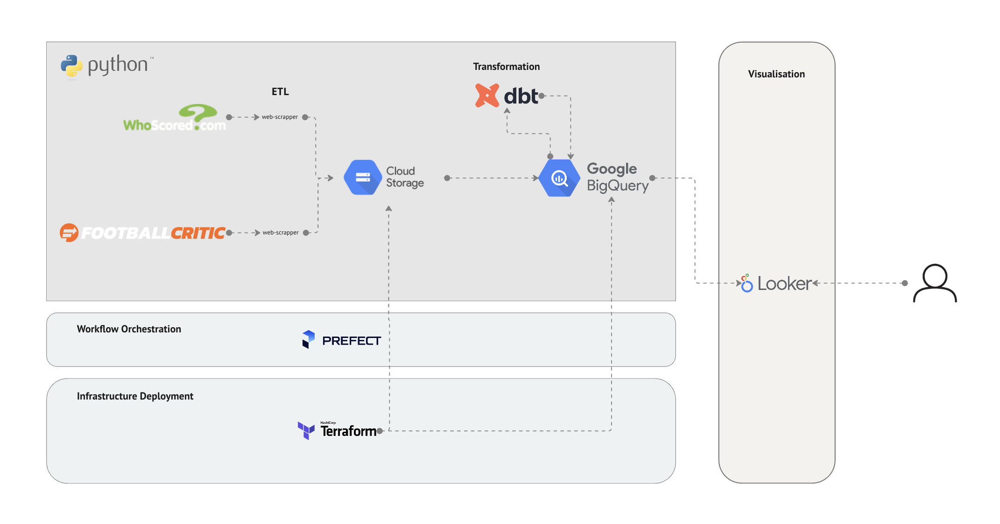
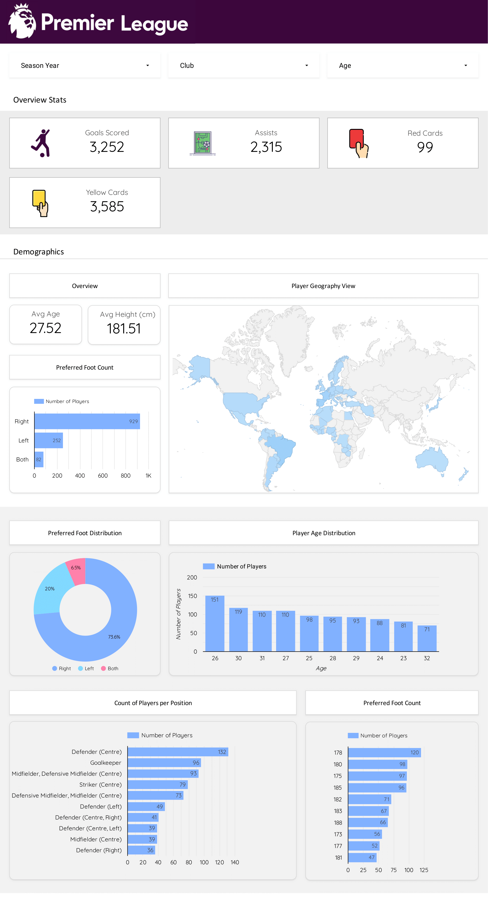

## English Premier League Analytics Project

### Problem Statement
This project aims to create an end-to-end data pipeline that extracts English Premier League (EPL) football data from different sources, loads it into a Data Warehouse, transforms it within the same Data Warehouse, and exposes it to an end user through a Dashboard.

Initially, the Dashboard will show player stats and demographic data, and the following are some of the questions that could be answered using the Dashboard: 
- How many goals were scored in the 2022–2023 season?
- How many goals were scored by Chelsea Football Club?
- Which team got the most red cards in the 2020–2021 season?
- What is the average height of players by age, season, or country?
- Etc

Further, the Dashboard will provide a self-service list that will enable end users to perform a data dump of player data by season, age, club, etc.

### Data Sources
The following are the data sources feeding the data pipeline, and the data collected from each data source:

|Data source  |Collected data-points                            |
|-------------|-------------------------------------------------|
|[WhoScored](https://www.whoscored.com/) | Player names, minutes played, goals scored, assists made, yellow cards, red cards, shots per game, etc. |
|[Footcall Critic](https://www.footballcritic.com/) | Player names, current club, nationality, age, playing positions, etc. |

### Architecture

The following is a details description of the architecture:

- `Infrastructure:` For provisioning the necessary infrastructure, in this case, `Cloud Storage` and `BigQuery`, I used `Terraform` for managing these resources in `Google Cloud Platform`.
- `Workflow Orchestration:` For managing the data pipeline and observing how long it ran, when it failed, etc, I used `Prefect` as the workflow orchestration tool.
- `ETL:` I structured the data pipeline as an ETL (Extract, Transform, Load) pipeline.
Extractor: At this level lies web scrappers, written in `Selenium` whose job is to extract the relevant data from the respective sources, and save it in a Pandas DataFrame.
- `Transform:` At this level, I perform minimal transformations such as extracting the age from date of birth, changing a field’s data type, etc.
Load: After the data is extracted and minimal transformations have been performed, the data is loaded into `Google Cloud Storage`.
- `GCP-BigQuery:` With the data sitting in `Google Cloud Storage`, I wrote pipeline that takes this data and places it into a `BigQuery Data Warehouse.`
- `dbt:` With the data sitting in `BigQuery`, I build models in dbt to transform the raw data into marts that enable end users to answer their questions quickly and easily.
- `Dashboard:` With the dbt models available for consumption, I connected `Looker Studio` to the Data Warehouse and build a Dashboard from the dbt marts.

### Technologies and Tools
- `Infrastructure as Code (IaC):` Terraform
- `Cloud:` Google Cloud Platform
- `Workflow Orchestration:` Prefect
- `Data Lake:` Google Cloud Storage (GCS)
- `Data Warehouse:` BigQuery
- `Data Transformations:` Data-Build Tool (dbt) & SQL
- `Data Visualization:` Looker Studio (Google Data Studio)
- `Programming Language:` Python

### Results: EPL Analytics Dashboard

The resulting Dashboard is designed to show an overview of English Premier League stats, and player demographic. On it, an end user can filter the data on the EPL Season,  Club or Age.

